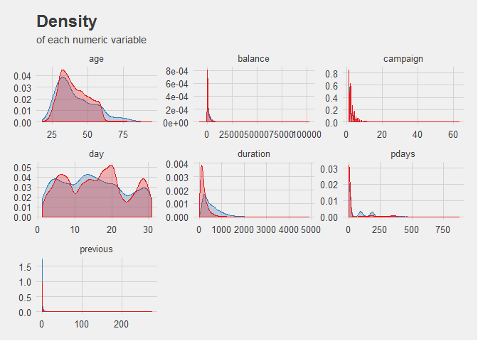
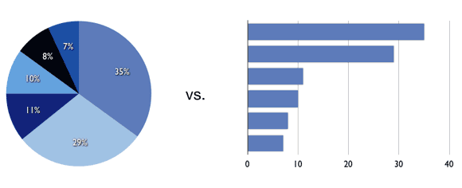
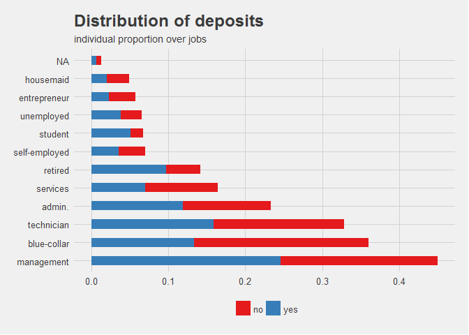
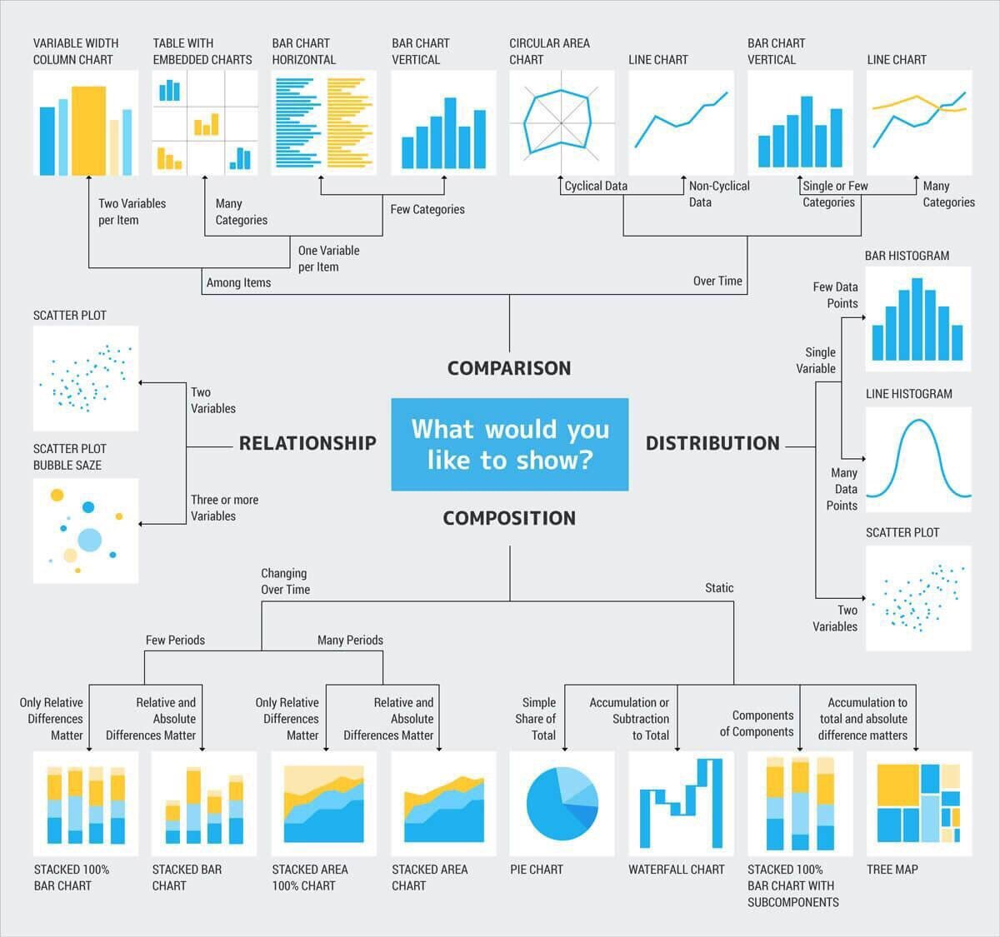

title: Data visualization principles
date: 2020-1-23 20:05
category:
tags:
slug: data-visualization-principles
author: Alex Gonzalez
summary: Conveying meaning through data visualization is not an easy task. Here is how you might get started.
header_cover: images/data-visualization/data-viz.jpeg
status: published

> Originally published on 2020-1-1. Updated with figures and examples, like a good post about data visualization.

When designing a visualization, there are usually four main topics that the author would want to highlight:

#### Comparison

These are used to compare the magnitude of values to each other and to easily identify the lowest or highest values in the data.

If you want to compare values over time, line or bar charts are often the best option and their choice depends on the number of periods you would like to analyze.
However, for comparisons among items, bar or column charts are preferred. Line charts provide a sense of continuity that might not be meaningful for categories.

Faceted charts are also a good option when dealing with many categories or dimensions. R's `ggplot2` package is specially useful for this.

For example, the above plot shows the density of each numerical variable in a dataset, using subplots or _facets_ to create a new dimension of visualization.

You can use pie charts for comparison as well, although the length of a column or bar is usually better at displaying differences in your data than the angle of a pie chart.

For example, examine the following figures:

For values differing very little, such as 10% to 11%, the difference is more noticeable when plotted in a bar chart with proper scaling. Labels normally alleviate this problem, but they also tend to increase clutter in the chart.

However, _I am not completely against pie charts_, as I think they can quick convey meaning when plotting attributes of low cardinality or dichotomic relations. Personally, I think 2 (or at most 3) different values should be shown on a pie chart so that it does not become confusing.  

#### Composition

Composition charts are used to see how a part of your data compares to the whole, and can show relative and absolute values. They can be used to accurately represent both static and time-series data.

For static data, a pie chart can do the job. However, there also other options that can tell the same story, such as a stacked bar chart, a waterfall chart or a tree map.
For time-based data, the number of periods is again a decisive factor when choosing your chart. You can visualize composition over many periods with area charts, which are very similar to line charts, and stacked bar or column charts when you have a reduced amount of periods.

  

It is important to consider that time-based visualization should be ordered chronologically as a general rule, and not by highest value, for example. Otherwise, those consuming the visualization might get the wrong conclusion when charts are not ordered according to expectations or convention.

#### Distribution

When studying how quantitative values are located along an axis, distribution charts are the way to go. By looking at the shape of the data, the user can identify features such as value range, central tendency and outliers.

One of the previous figures is actually an example of a distribution plot. Here's another one:

See how the relative values of the population are _distributed_ along the different age categories. Being a continuous range of integers, we use lines to represent the distribution. If instead, it were categories (i.e. age 18 - 35) we would use columns.

With this charts, the interest is in the full picture of the data and this can lead to having many data points (note: not categories!). In these cases, it's often better to use a line histogram, while column histograms are great for few data points.
In any case, when analyzing distribution for two variables at once, a scatter plot allows to compare between the full picture of two dimensions.

#### Relationship

Relationship charts have a constrained set of options as normally scatter plots are the only adequate way of presenting the data. They are used to find correlations, outliers, and clusters in your data.

While the human eye can only appreciate three dimensions together, you can visualize additional variables by mapping them to the size, color or shape of your data points.

In this example, the chart can be used to study 3 variables at the same time: number of marketing calls, their duration, and whether their outcome is a sale or not. To aid the human eye, the third dimension is mapped to a color based on the value of their factors.
Thanks to this, we can see that calls that do not result in a sale are concentrated along the lower bounds of the Y axis, meaning more calls increases the likelihood of conversion.

See the image below for reference:

> As a bonus tool, if you run into issues trying to find the best set of colors for your report or chart, make sure to check out [Coolors](https://coolors.co/). This is a web app that provides color scales, palettes and blends based on the color of your choice.